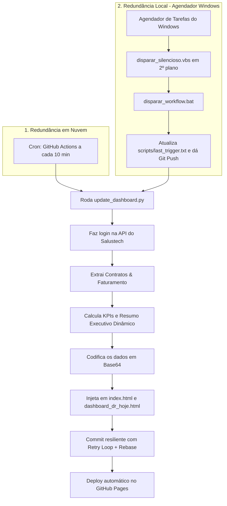

# DR. HOJE — Dashboard Executivo de Vendas & Faturamento

Este repositório contém o painel estático interativo de indicadores da **DR. HOJE**, com foco no acompanhamento da carteira de beneficiários (vidas ativas), movimentação (inclusões e exclusões), distribuição por produtos e visão consolidada de faturamento (receita gerada vs. paga).

O painel é atualizado de forma 100% automatizada por meio de um script em Python integrado ao GitHub Actions e hospedado diretamente no **GitHub Pages**.

---

## 🚀 Arquitetura & Como Funciona

O projeto opera sob uma arquitetura de **Dupla Redundância**:



1. **GitHub Actions (Cron):** A cada 10 minutos, o GitHub dispara o workflow `.github/workflows/update_data.yml`.
2. **Agendador do Windows (Redundância Local):** Dispara em segundo plano via `disparar_silencioso.vbs` acionando o gatilho sem abrir janelas no sistema.
3. **Resiliência contra Conflitos:** O workflow utiliza um algoritmo de **retry loop (até 3 tentativas com `git pull --rebase`)** para garantir que conflitos de commits concorrentes sejam resolvidos automaticamente sem falhas no deploy.
4. **Extração & Validação:** O script se conecta à API da Salustech, puxa os registros mais recentes e atualiza os arquivos `index.html` e `dashboard_dr_hoje.html`.
5. **Publicação (Deploy):** Havendo novos registros, o robô realiza o commit das alterações na branch `main`, atualizando o painel no GitHub Pages em menos de 2 minutos.


---

## 🔒 Segurança & Ofuscação de Dados

Como este repositório está configurado como **Público** para permitir o acesso ao painel via link externo sem necessidade de conta no GitHub (para o CEO e diretores), foram aplicadas as seguintes medidas de segurança:

1. **Credenciais Estáticas Ofuscadas:**
   * Usuários e senhas de acesso do painel de login não constam em texto limpo no código.
   * O código compara apenas o resultado de um algoritmo de hash **DJB2** gerado a partir da combinação do usuário e senha (`usuario:senha`). 
   * Mesmo inspecionando o código fonte, só é possível ver hashes hexadecimais como `e10240d8`.
2. **Dados Ofuscados no HTML (Base64):**
   * O payload JSON com os dados consolidados do painel (faturamento, vidas, nomes) não fica em texto limpo.
   * O script Python compacta e codifica os dados em **Base64** (`const DATA_RAW`).
   * No carregamento da página, o navegador decodifica a string dinamicamente usando a API nativa `TextDecoder`. Isso evita que rastreadores (crawlers) ou pessoas curiosas vejam dados sensíveis lendo o código do repositório.

---

## 🛠️ Configuração Local

Caso precise atualizar o painel manualmente ou rodar o script localmente, siga estes passos:

### 1. Pré-requisitos
Certifique-se de ter o Python 3.10+ instalado e instale as dependências necessárias:
```bash
pip install pandas requests
```

### 2. Variáveis de Ambiente
Crie um arquivo chamado `.env` na raiz do projeto com as credenciais da API do Salustech:
```env
SALUSTECH_USER=usuario_aqui
SALUSTECH_PASS=senha_aqui
SALUSTECH_COMPANY=empresa_aqui
```

### 3. Executando a Atualização
Rode o script de sincronização:
```bash
python update_dashboard.py
```
Isso gerará os novos dados locais e atualizará os arquivos `index.html` e `dashboard_dr_hoje.html` com o payload compactado em Base64.

---

## ⚙️ Configuração no GitHub

Para que o deploy automático funcione, é obrigatório cadastrar as chaves de acesso nas configurações do repositório no GitHub:

1. Vá em **Settings** > **Secrets and variables** > **Actions** > **New repository secret**.
2. Cadastre as chaves com os mesmos valores do arquivo `.env`:
   * `SALUSTECH_USER`
   * `SALUSTECH_PASS`
   * `SALUSTECH_COMPANY`

---

## 📊 Páginas do Dashboard
O painel é estruturado em 4 visões interativas de rápida navegação:
* **Visão Executiva Vendas:** KPIs de vidas ativas (Empresarial vs. Adesão), ranking de produtos e gráficos de inclusões diárias por período.
* **Visão Executiva Movimentação:** Gráficos de barra/linha com a evolução mensal (Inclusões vs. Exclusões), motivos das baixas, Top 5 contratos empresariais e um **Resumo Executivo dinâmico de 4 pontos**.
* **Vidas Ativas por Produto:** Tabela detalhada de distribuição de vidas.
* **Visão Faturamento:** Comparativo mensal e por segmento (Empresarial vs. Adesão) da receita gerada versus a receita efetivamente paga no ano.
